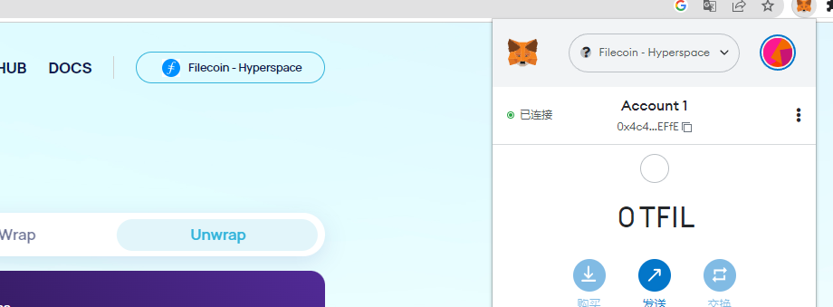
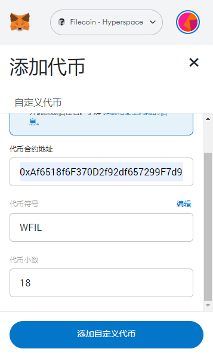
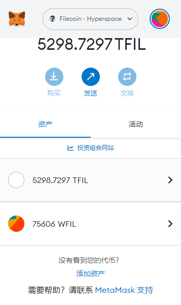

1.Open metamask, make sure Filecoin is also selected as your network.

2.click [Import tokens], input the WFIL contract address and click [Add custom token]

3.Check the information, click [Import tokens]

4.Next, click [Send]. The next steps are the same as normal transfer
