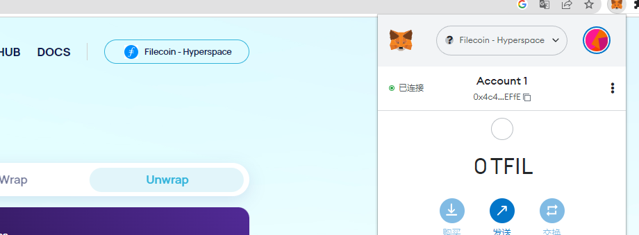
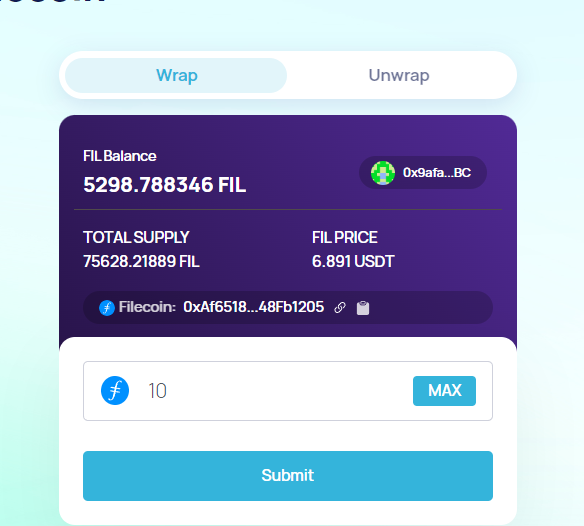
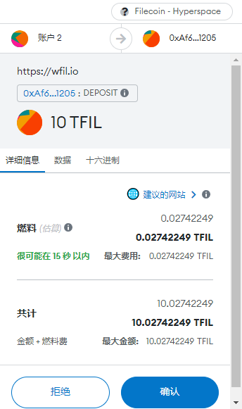
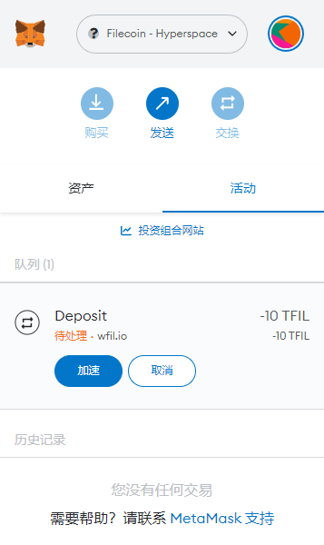

1. Open wFIL console and connect your wallet. Make sure Filecoin is also selected as your network.

2.Select Warp in the top, input the amount of FIL you want to convert to WFIL and click the [Submit] button.

3.You’ll now need to confirm the transaction in your crypto wallet. Don’t forget that you’ll also need to pay gas fees, so make sure to have extra FIL at hand. Check the details of the transaction and click [Confirm].

4.Now you just need to wait for the transaction to be confirmed in the blockchain. The waiting time will depend on the current network traffic. If you are in a hurry, you can speed up the transaction (i.e., pay higher fees) to have it confirmed faster.
